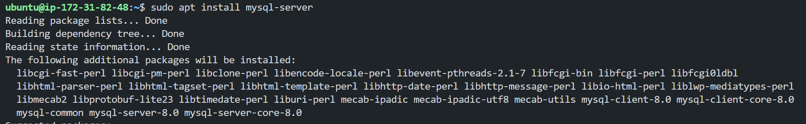
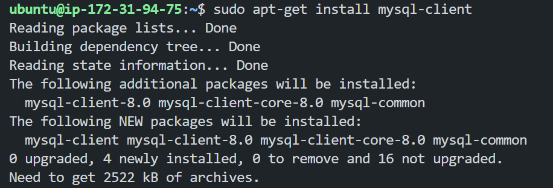
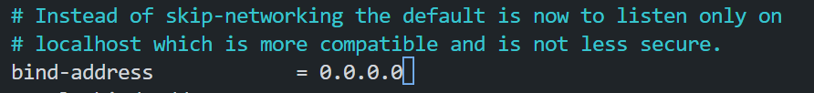

# CLIENT-SERVER ARCHITECTURE WITH MYSQL

Client-Server refers to an architecture in which two or more computers are connected together over a network to send and receive requests between one another.

In their communication, each machine has its own role: the machine sending requests is usually referred as "Client" and the machine responding (serving) is called "Server".

In this case, our Web Server has a role of a "Client" that connects and reads/writes to/from a Database (DB) Server (MySQL, MongoDB, Oracle, SQL Server or any other), and the communication between them happens over a Local Network (it can also be Internet connection, but it is a common practice to place Web Server and DB Server close to each other in local network).

# Implementing a Client Server Architecture using MySQL Database Management System (DBMS).
In this project I would be demonstrating a basic client-server using MySQL Relational Database Management System (RDBMS), follow the below instructions

- Create and configure two Linux-based virtual servers (EC2 instances in AWS) with names.
    ```
    Server A name - `mysql server`
    Server B name - `mysql client`
    ```

- On mysql server Linux Server install MySQL Server software.
    ```
    sudo apt install mysql-server
    ```
    Results:
    

- On mysql client Linux Server install MySQL Client software.
    ```
    sudo apt install mysql-client
    ```
    Results:
    

- By default, both of your EC2 virtual servers are located in the same local virtual network, so they can communicate to each other using local IP addresses. Use mysql server's local IP address to connect from mysql client. MySQL server uses TCP port 3306 by default, so you will have to open it by creating a new entry in ‘Inbound rules’ in ‘mysql server’ Security Groups. For extra security, do not allow all IP addresses to reach your ‘mysql server’ – allow access only to the specific local IP address of your ‘mysql client’.

    Results:
    

- You might need to configure MySQL server to allow connections from remote hosts.
    ```
    sudo nano /etc/mysql/mysql.conf.d/mysqld.cnf
    ```
    and replace the following line:
    ```
    bind-address = 127.0.0.1 
    ```
    with the following line:
    ```
    bind-address = 0.0.0.0
    ```

    Results:
    

- 